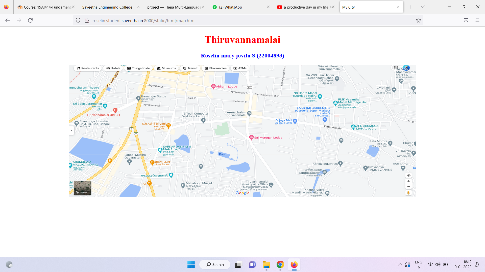
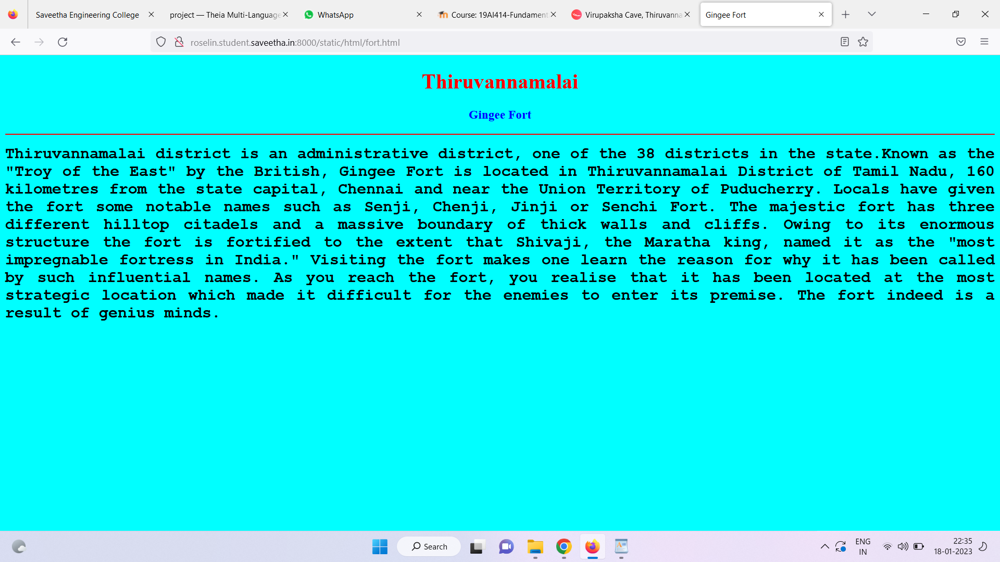
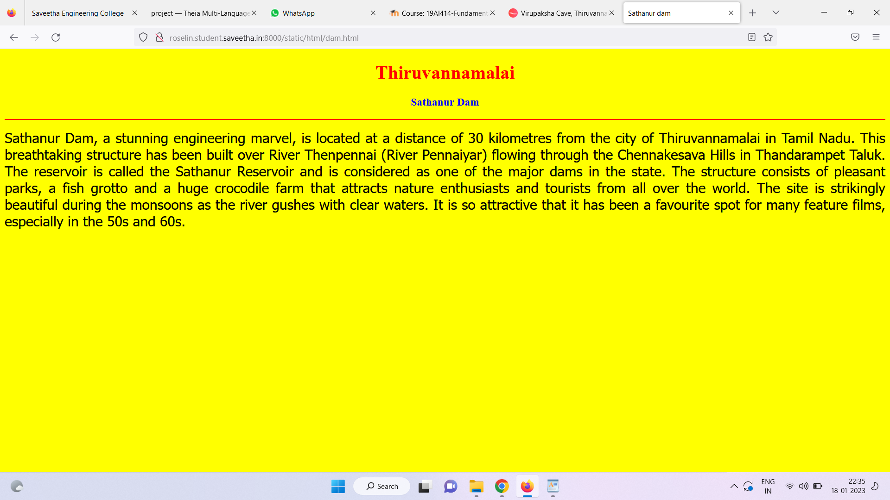
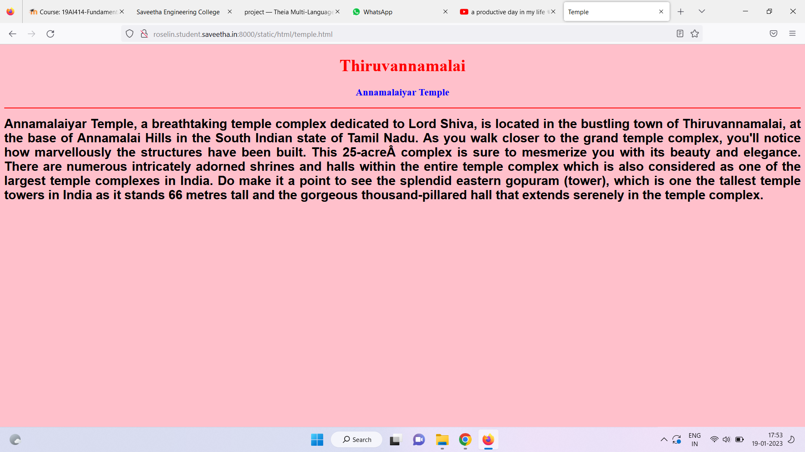
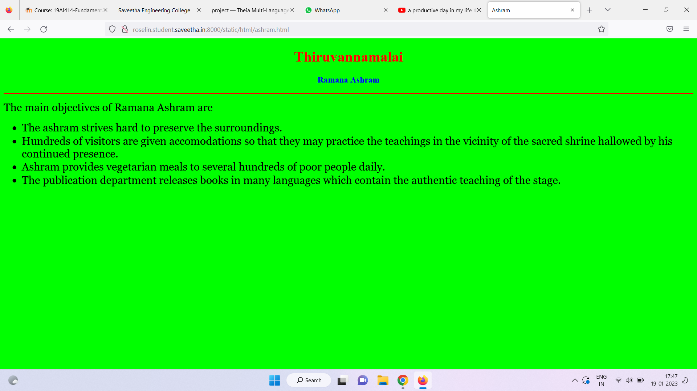
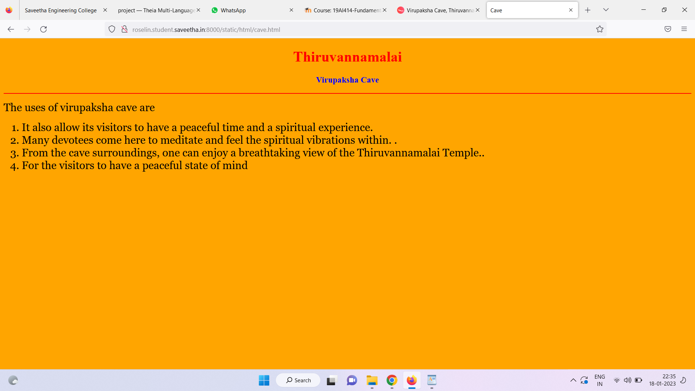

# Places Around Me
## AIM:
To develop a website to display details about the places around my house.

## Design Steps:

### Step 1:
clone the github repository into Thiea IDE.

### Step 2:
create a new Django project

### Step 3:
write the needed HTML code.

### Step 4:
Run the Django server and execute the HTML files.

## Code:
```
map.html
<!DOCTYPE html>
<html lang="en">
<head>
<title>My City</title>
</head>
<body>
<h1 align="center">
<font color="red"><b>Thiruvannamalai</b></font>
</h1>
<h3 align="center">
<font color="blue"><b>Roselin mary jovita S (22004893)</b></font>
</h3>
<center>

<map name="MyCity">
<area shape="circle" coords="190,50,20" href="/static/html/fort.html" title="Gingee fort">
<area shape="rectangle" coords="230,30,260,60" href="/static/html/dam.html" title="Sathanur dam">
<area shape="circle" coords="400,350,50" href="/static/html/temple.html" title="Annamalaiyar temple">
<area shape="circle" coords="400,200,75" href="/static/html/ashram.html" title="Ramana ashram">
<area shape="rectangle" coords="490,150,870,320" href="/static/html/cave.html" title="Virupaksha cave">
</map>
</center>
</body>
</html>

fort.html
<!DOCTYPE html>
<html lang="en">
<head>
<title>Gingee Fort</title>
</head>
<body bgcolor="cyan">
<h1 align="center">
<font color="red"><b>Thiruvannamalai</b></font>
</h1>
<h3 align="center">
<font color="blue"><b>Gingee Fort</b></font>
</h3>
<hr size="3" color="red">
<p align="justify">
<font face="Courier New" size="5">
<b>
Thiruvannamalai district is an administrative district, one of the 38 districts in the 
state.Known as the "Troy of the East" by the British, Gingee Fort is located in Thiruvannamalai District of Tamil Nadu, 
160 kilometres from the state capital, Chennai and near the Union Territory of Puducherry. 
Locals have given the fort some notable names such as Senji, Chenji, Jinji or Senchi Fort.
 The majestic fort has three different hilltop citadels and a massive boundary of thick walls and cliffs.
  Owing to its enormous structure the fort is fortified to the extent that Shivaji, the Maratha king, named it as the "most impregnable fortress in India." 
  Visiting the fort makes one learn the reason for why it has been called by such influential names.
  As you reach the fort, you realise that it has been located at the most strategic location which made it difficult for the enemies to enter its premise.
  The fort indeed is a result of genius minds.
</b>
</font>
</p>
</body>
</html>

dam.html
<!DOCTYPE html>
<html lang="en">
<head>
<title>Sathanur dam</title>
</head>
<body bgcolor="yellow">
<h1 align="center">
<font color="red"><b>Thiruvannamalai</b></font>
</h1>
<h3 align="center">
<font color="blue"><b>Sathanur Dam</b></font>
</h3>
<hr size="3" color="red">
<p align="justify">
<font face="Tahoma" size="5">
Sathanur Dam, a stunning engineering marvel, is located at a distance of 30 kilometres from the city of Thiruvannamalai in Tamil Nadu.
This breathtaking structure has been built over River Thenpennai (River Pennaiyar) flowing through the Chennakesava Hills in Thandarampet Taluk.
The reservoir is called the Sathanur Reservoir and is considered as one of the major dams in the state.
The structure consists of pleasant parks, a fish grotto and a huge crocodile farm that attracts nature enthusiasts and tourists from all over the world.
The site is strikingly beautiful during the monsoons as the river gushes with clear waters.
It is so attractive that it has been a favourite spot for many feature films, especially in the 50s and 60s.
</font>
</p>
</body>
</html>

temple.html
<!DOCTYPE html>
<html lang="en">
<head>
<title>Temple</title>
</head>
<body bgcolor="pink">
<h1 align="center">
<font color="red"><b>Thiruvannamalai</b></font>
</h1>
<h3 align="center">
<font color="blue"><b>Annamalaiyar Temple</b></font>
</h3>
<hr size="3" color="red">
<p align="justify">
<font face="Arial" size="5">
<b>
Annamalaiyar Temple, a breathtaking temple complex dedicated to Lord Shiva, is located in the bustling town of Thiruvannamalai, at the base of Annamalai Hills in the South Indian state of Tamil Nadu.
As you walk closer to the grand temple complex, you'll notice how marvellously the structures have been built.
This 25-acre complex is sure to mesmerize you with its beauty and elegance.
There are numerous intricately adorned shrines and halls within the entire temple complex which is also considered as one of the largest temple complexes in India.
Do make it a point to see the splendid eastern gopuram (tower), which is one the tallest temple towers in India as it stands 66 metres tall and the gorgeous thousand-pillared hall that extends serenely in the temple complex.
</b>
</font>
</p>
</body>
</html>

ashram.html
<!DOCTYPE html>
<html lang="en">
<head>
<title>Ashram</title>
</head>
<body bgcolor="lime">
<h1 align="center">
<font color="red"><b>Thiruvannamalai</b></font>
</h1>
<h3 align="center">
<font color="blue"><b>Ramana Ashram</b></font>
</h3>
<hr size="3" color="red">
<p align="justify">
<font face="Georgia" size="5">
The main objectives of Ramana Ashram are 
<ul>
<li>The ashram strives hard to preserve the surroundings.</li>
<li>Hundreds of visitors are given accomodations so that they may practice the teachings in the vicinity of the sacred shrine hallowed by his continued presence.</li>
<li>Ashram provides vegetarian meals to several hundreds of poor people daily.</li>
<li>The publication department releases books in many languages which contain the authentic teaching of the stage.</li>
</ul>
</font>
</p>
</body>
</html>

cave.html
<!DOCTYPE html>
<html lang="en">
<head>
<title>Cave</title>
</head>
<body bgcolor="orange">
<h1 align="center">
<font color="red"><b>Thiruvannamalai</b></font>
</h1>
<h3 align="center">
<font color="blue"><b>Virupaksha Cave</b></font>
</h3>
<hr size="3" color="red">
<p align="justify">
<font face="Georgia" size="5">
The uses of virupaksha cave are 
<ol type="1">
<li>It also allow its visitors to have a peaceful time and a spiritual experience.</li>
<li>Many devotees come here to meditate and feel the spiritual vibrations within. .</li>
<li>From the cave surroundings, one can enjoy a breathtaking view of the Thiruvannamalai Temple..</li>
<li>For the visitors to have a peaceful state of mind</li>
</ol>
</font>
</p>
</body>
</html>
```

## Output:












## HTML Validator


## Result:
The program for implementing image map is executed successfully